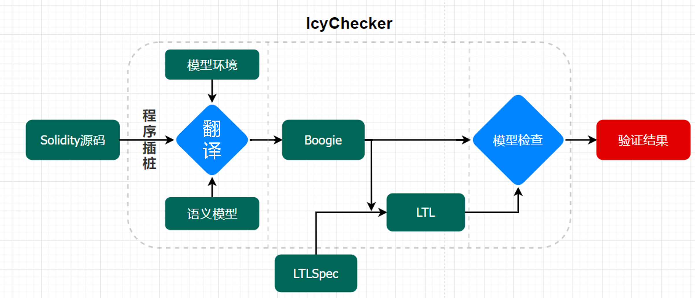

# IcyChecker
A Intention-to-Code consistency checker for Smart Contracts.

该工具由中山大学InplusLab和微众银行团队共同合作修改和推进。


## 快速上手

#### 1 直接使用

由于目前工具有较多的依赖项，例如python2、java8、dotnet2.2等，为了实现工具的即插即用，我们在[docker hub](https://hub.docker.com/repository/docker/inplus/icychecker)上提供了一个已经配置好的Docker镜像(897.74 MB)，它已经配置好了所有内容，你可以通过非常简单的命令开始你的尝试。

1. 拉取镜像

```bash
docker pull inplus/icychecker
```

你也可从[docker hub上直接上找到它](https://hub.docker.com/repository/docker/inplus/icychecker)。

2. 运行容器

```bash
docker run -it inplus/icychecker /bin/bash
```

3. 进入工具文件夹

```bash
cd ~/icychecker
```

4. 激活环境变量

```
source /etc/profile
```

4. 开始使用

   详见下一部分。

> 你完全可以使用交互式的方式来进行访问，工具的翻译和验证代码已位于其中。

> 注：容器是在ubuntu x64环境下导出的，需使用相同的指令集架构的环境来运行。

> 注：受先前部署时遇到的问题，这一次我们尽可能减小了容器的大小，同时也将许多地方修改为无需额外下载和配置。如果你需要修改，请参考逐步配置中提到的方法。

#### 2 逐步配置

直接参考依赖工具构建方法，点击[原始构建](originBuild.md)查看如何构建。


## 使用方法

工具的运行原理如下所示。



在使用之前，你可能需要学习[规约概述](spec.md)，但这不是必要的，学习它只是为了更好地理解如何写出一个正确的规约。当然为了了解更多目前工具支持的规约和使用场景，也许你还需要参看[支持场景](availableSpec.md)，用一些案例理解规约的原理。

为了方便更快上手IcyChecker，我们也提供了两个在实际场景中非常常见的**规约模板**。

### 模板1

- 文字描述：合约中变量x在合约运行生命周期中不会出现某性质

- 规约模板：`#LTLProperty: !<>(运行状态(函数, 表达式))`

- 运行状态可选：finished，started分别代表结束和开始

- 函数可选：*代表任意函数，合约.函数名表示具体函数

- 表达式：一阶逻辑表示式，包括加减乘除、大于、小于和等于

**示例**：

- 合约：counter.sol

- 文字描述： this.tool.counter.value在运行过程中不会小于0

- 规约语言：

  ```
   // #LTLProperty: !<>(finished(*, this.tool.counter.value < 0))
  ```

- 验证脚本：

```
./IcyChecker.py test/counter.sol CounterUtil test/counter.spec
```

### 模板2

- 语言描述：满足Fairness中事件执行的情况下，Property满足相应性质

- 规约模板：`// #LTLFairness: [](<>运行状态(函数, 表达式))`

  ​			  	 `//#LTLProperty: [](<>运行状态(函数, 表达式))`

- 运行状态可选：同上，例如started和finished

- 函数可选：同上，所有函数或某一具体函数

- 表达式：同上，一阶逻辑表示式

**示例**：

- 合约：RevertDos.sol

- 文字描述： 开始执行bid函数后，bid应该被执行完毕

- 规约语言：

  ```
  // #LTLFairness: [](<>(started(Auction.bid, msg.value > this.currentBid)))
  // #LTLProperty: [](<>(finished(Auction.bid)))
  ```

- 验证脚本（考虑存在重入情形）：

```
./IcyChecker.py -singleCallback test/RevertDos.sol Auction test/RevertDos.spec 
```

> 注：更多相应的验证可用参数可通过-h进行查看。


## 依赖工具

本项目基于现有的两个工具进行研究和开发：

* [VeriSol](https://github.com/utopia-group/verisol)
* [SmartPulseTool](https://github.com/utopia-group/SmartPulseTool/tree/master)

保留了对工具原有特性的支持，也即是说，原有工具的数据集同样能得到验证。

同样的，如要了解当前工具的细节，除本文档以外，也可以参考原仓库对相应部分内容的描述。


## 参考资料

* VeriSol: [Formal Verification of Workflow Policies for Smart Contracts in Azure Blockchain.](https://doi.org/10.1007/978-3-030-41600-3_7)

* SmartPulse: [SmartPulse: Automated Checking of Temporal Properties in Smart Contracts.](https://doi.org/10.1109/SP40001.2021.00085)

* Model Checking: [Handbook of Model Checking](https://link.springer.com/book/10.1007/978-3-319-10575-8)

  

